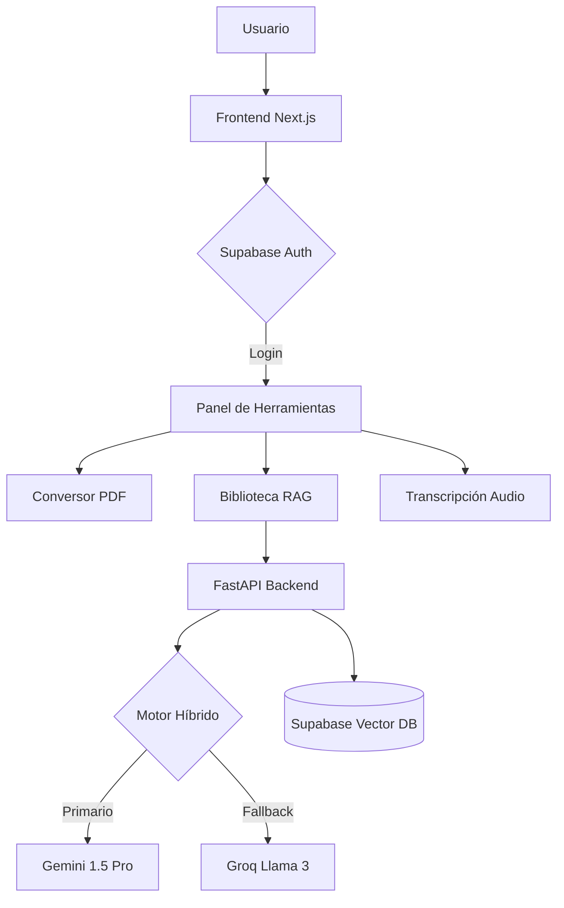

# 🚀 AAUCATools Community - Plataforma Académica Inteligente

**AAUCATools Community** es la navaja suiza de inteligencia artificial diseñada específicamente para la comunidad estudiantil de la **AAUCA**. Esta plataforma permite transformar, transcribir y analizar documentos académicos utilizando los motores de IA más avanzados del mercado.

---

## 💎 Características "God Tier"

### 📚 Biblioteca Inteligente (RAG Engine)
- **Análisis Profundo**: Sube tus libros (PDF) y realiza consultas complejas.
- **Resumen Ejecutivo**: Generación automática de resúmenes estructurados.
- **Motor Híbrido**: Sistema de fallback automático entre **Gemini 1.5 Pro** y **Groq (Llama 3)** para asegurar 100% de disponibilidad.

### 🔄 Conversor Total (Office Engine)
- **Precisión Quirúrgica**: Conversión de PDF a formatos editables (`.docx`, `.xlsx`, `.pptx`).
- **Preservación de Estilo**: Mantiene tablas y estructuras originales.

### 🎙️ Audio-Notas (Whisper V3)
- **Transcripción Instantánea**: Convierte grabaciones de clase en texto con alta fidelidad usando el motor **Whisper-Large-V3** vía Groq.

### 🔒 Seguridad y Privacidad
- **Auth de Grado Militar**: Integración con Supabase Auth y Google OAuth.
- **Borrado Agresivo de Cache**: Limpieza automática de datos locales y remotos al cerrar sesión.

---

## 🛠️ Stack Tecnológico

| Componente | Tecnología |
| :--- | :--- |
| **Frontend** | Next.js 15, React 19, Framer Motion, Tailwind CSS 4 |
| **Backend** | FastAPI, Python 3.11, Uvicorn |
| **IA Motor** | Google Gemini (Pro/Flash), Groq (Llama 3), Whisper V3 |
| **Base de Datos** | Supabase (PostgreSQL + pgvector) |
| **Infraestructura** | Vercel (Frontend), Render (Backend) |

---

## 🏗️ Arquitectura Técnica

---

## ⚙️ Configuración y Despliegue

### 1. Variables de Entorno
Crea un archivo `.env` basado en `.env.example` con las siguientes claves:

#### Backend (Render/Docker)
- `GEMINI_API_KEY`: Clave de [Google AI Studio](https://aistudio.google.com/).
- `GROQ_API_KEY`: Clave de [Groq Cloud](https://console.groq.com/).
- `SUPABASE_URL`: URL de tu proyecto en Supabase.
- `SUPABASE_KEY`: Clave `service_role` de Supabase.

#### Frontend (Vercel)
- `NEXT_PUBLIC_SUPABASE_URL`: URL pública de Supabase.
- `NEXT_PUBLIC_SUPABASE_ANON_KEY`: Anon Key de Supabase.
- `NEXT_PUBLIC_BACKEND_URL`: URL de tu backend desplegado (ej. Render).

### 2. Configuración de Google Login (Supabase)
Para que el inicio de sesión con Google sea funcional en producción:
1.  En **Google Cloud Console**, añade la URL de callback de Supabase en "URIs de redireccionamiento autorizados".
2.  En **Supabase**, ve a `Authentication -> URL Configuration` y añade la URL de Vercel en `Redirect URLs`:
    - `https://tu-app.vercel.app/chat`

---

## 👨‍💻 Desarrollo

Desarrollado con ❤️ por **Tranquilino Mba Ncogo** para la Ciudad de la Paz, Oyala.
© 2026 AAUCATools Community.
